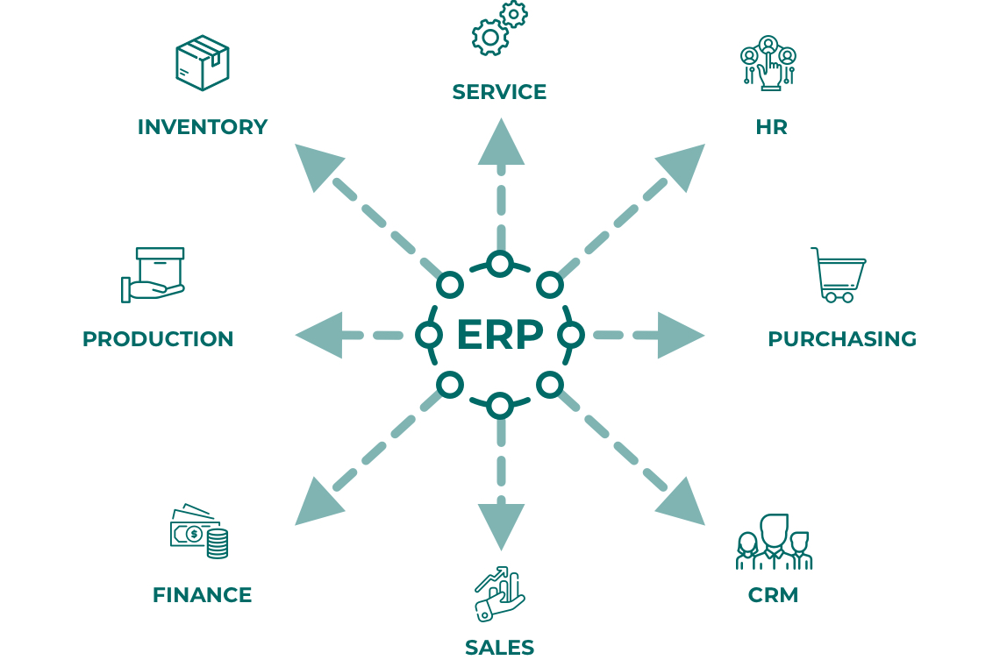

# Hi, I'm Nguyen Quang Hieu 👨🏻‍💻

<!--  -->

Software Developer with almost 2 years of working experience in IT. My goal is to become Senior Developer in 3 years, after 5 years becoming Tech Lead.

𝗛𝗮𝗿𝗱 𝘀𝗸𝗶𝗹𝗹𝘀:
- Python, Django, Flask, Odoo
- Javascript, jQuery, Ajax, React, OWL
- Java Android
- MySQL, PostgreSQL
- Linux
- Git

- 🌍 I'm based in Vietnamese
- 🖥️ See my portfolio at [hieunqdev](https://www.linkedin.com/in/hieu-nguyen-2070962b3/)
- ✉️ You can contact me at [hieunqdev@gmail.com](mailto:hieunqdev@gmail.com)
- 🚀 I'm currently working on [Magenest](http://magenest.com/en/)

**Thank you very much for your time. I hope the best of luck will come to you. Wish you achieve the goals that you have set.**
